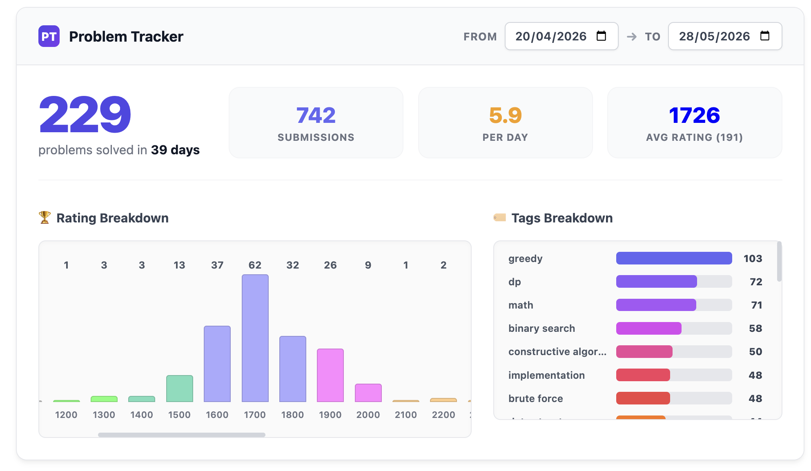
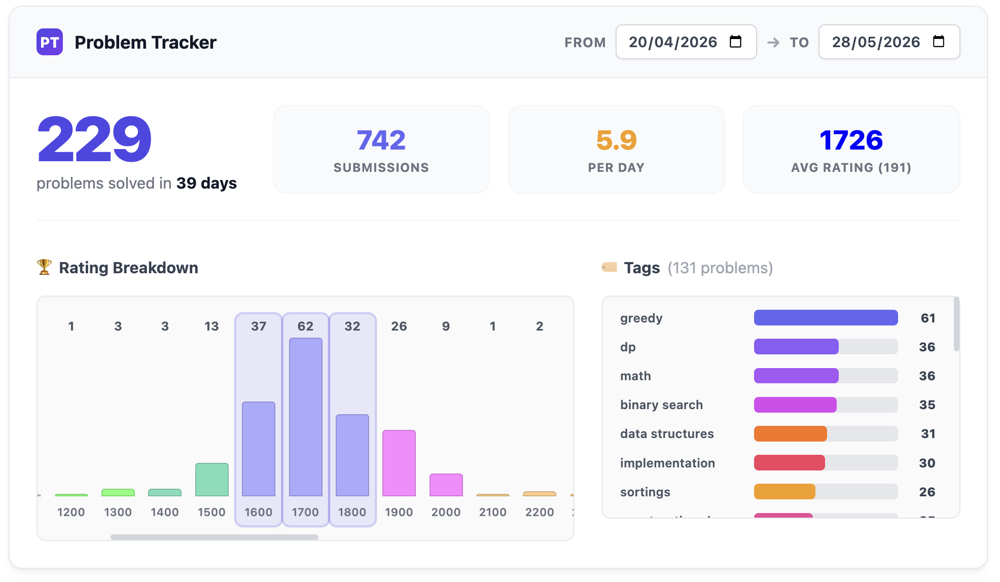
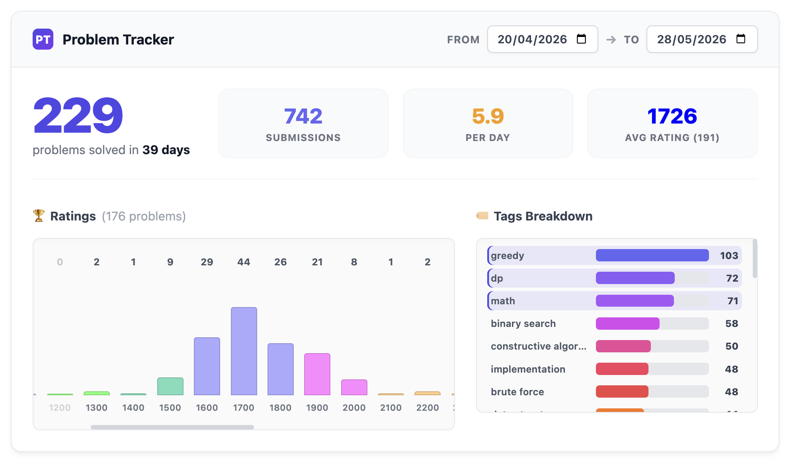

<div align="center">
  <h1>🏆 CF Problem Tracker</h1>
  
  <p><strong>A premium, highly interactive Chrome extension that supercharges your Codeforces profile with deep analytics!</strong></p>

  
  
  
</div>

---

## ✨ Features

- **📊 Comprehensive Dashboard:** Instantly view your total solved problems, total submissions, average problems solved per day, and **average rating** of your solved problems.
- **📅 Custom Date Ranges:** Analyze your performance over any specific period (e.g., last 30 days, 1 year).
- **📈 Rating Breakdown:** Beautiful interactive bar charts showing the difficulty levels of problems you've solved.
- **🏷️ Tag Analytics:** Discover your most practiced topics with detailed tag frequency bars and dynamic gradients.
- **🔄 Powerful Cross-Filtering:** 
  - Click on any **Tag** to instantly see the rating distribution for that specific topic.
  - Click on any **Rating** to see exactly which tags you solved at that difficulty.
  - *Supports Multi-selection & Click-outside to reset!*
- **🛡️ Robust Reliability:** Graceful handling of Codeforces downtime or API errors to ensure a clean browser experience without broken UI elements.
- **🎨 Premium UI:** Smooth micro-animations, custom tooltips, glassmorphic elements, and a sleek modern design.

---

## 📸 Screenshots

### 1. Main Analytics Dashboard


### 2. Rating Filter Active


### 3. Tags Cross-Filtering Active


---

## 🚀 Installation

1. Clone this repository:
   ```bash
   git clone https://github.com/AashwatJain/CF-Problem-Tracker.git
   ```
2. Open Google Chrome and navigate to `chrome://extensions/`.
3. Enable **"Developer mode"** in the top right corner.
4. Click on **"Load unpacked"** and select the cloned `CF-Problem-Tracker` folder.
5. Open any Codeforces Profile (e.g., `https://codeforces.com/profile/Tourist`) and scroll down to see your new analytics!

---

## 🛠️ Built With

- **JavaScript (ES6+)**: For fetching and processing data from the Codeforces API.
- **Vanilla CSS3**: No frameworks used! Pure CSS with custom animations, flexbox layouts, and modern UI principles.
- **Codeforces API**: Fetches live submission data efficiently with local caching.

---

<div align="center">
  <i>Made with ❤️ for the Competitive Programming Community.</i>
</div>
